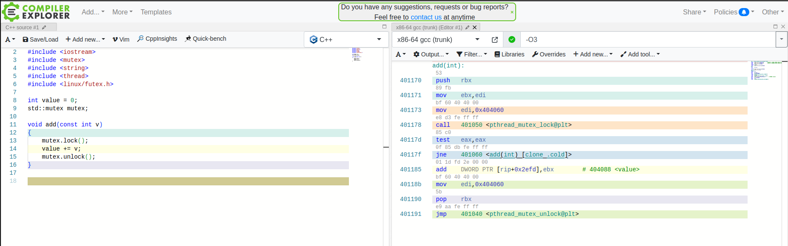

# Concurrencly

## Thread safety

### Mutex
[mutex](https://en.cppreference.com/w/cpp/thread/mutex)

The mutex class is a synchronization primitive that can be used to protect shared data from being simultaneously accessed by multiple threads. 

std::mutex will execute a system call `pthread_mutex_lock` that is a part of [pthred](https://www.man7.org/linux/man-pages/man3/pthread_mutex_lock.3p.html)

Inctruction genereted by GCC:

### LockGuard

## Loock free structures

## Wait free structures

## Atomic and memory order

Prerequisit of the memory order is [order of evaluation](https://en.cppreference.com/w/cpp/language/eval_order)

The default behavior of all atomic operations in the library provides for sequentially consistent ordering. That default can hurt performance, but the library's atomic operations can be given an additional std::memory_order argument to specify the exact constraints, beyond atomicity, that the compiler and processor must enforce for that operation. 

### Atomic operations

- load: write operation
- store: read operation
- fetch_add/fetch_sub and operator+=,-=: atomicly do math with given argument and currently stored value of atomic
- fetch_and/fetch_or/fetch_xor and operator&=,|=,^=: bitwise operations, supported only with the integral types
- exchange: replace the value
- compare_exchange_weak/compare_exchange_strong: Read-Modify-Write operation. Weak might fail, and require the loop to succeed.

### Memory order

[std::memory_order](https://en.cppreference.com/w/cpp/atomic/memory_order)

- std::memory_order_relaxed

No synchronization or ordering constraints imposed on other reads or writes, only this operation's atomicity is guaranteed 

- std::memory_order_consume

no reads or writes in the current thread dependent on the value currently loaded can be reordered before this load. Writes to data-dependent variables in other threads that release the same atomic variable are visible in the current thread. On most platforms, this affects compiler optimizations only

- std::memory_order_aquire

No reads or writes in the current thread can be reordered before this load. All writes in other threads that release the same atomic variable are visible in the current thread

- std::memory_order_release

No reads or writes in the current thread can be reordered after this store. All writes in the current thread are visible in other threads that acquire the same atomic variable and writes that carry a dependency into the atomic variable become visible in other threads that consume the same atomic. 

- std::memory_order_acq_rel

A read-modify-write operation with this memory order is both an acquire operation and a release operation. No memory reads or writes in the current thread can be reordered before the load, nor after the store. All writes in other threads that release the same atomic variable are visible before the modification and the modification is visible in other threads that acquire the same atomic variable. 

- std::memory_order_seq_cst

A load operation with this memory order performs an acquire operation, a store performs a release operation, and read-modify-write performs both an acquire operation and a release operation, plus a single total order exists in which all threads observe all modifications in the same order

## Ring buffer approach

## Compare and swap
