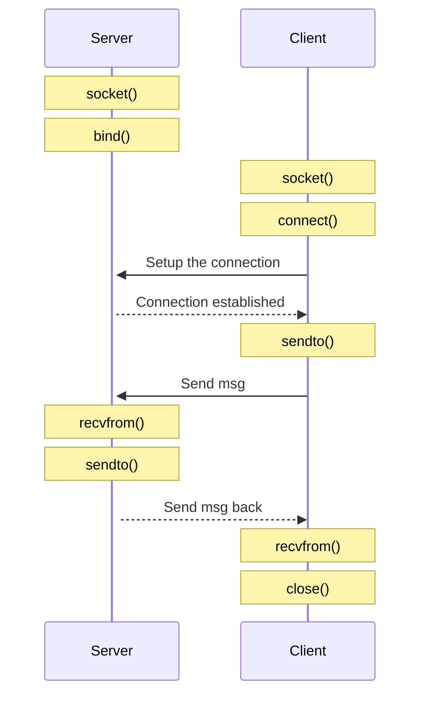
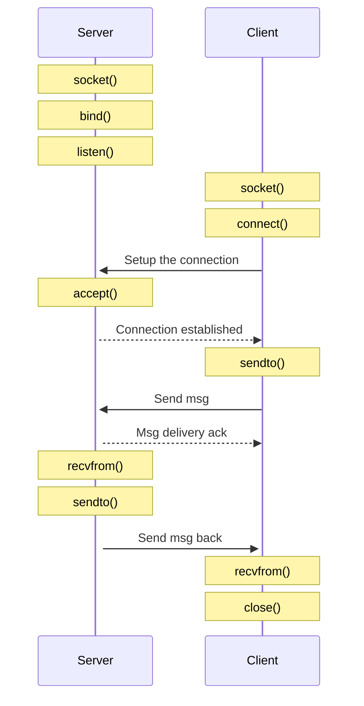

# Network

## About

Collection of classes for the network communication.


## Network management


Network stack consist of multiple laeyers and can be considered


For low latency critical system it creates a challange that a lot of operations happen in kernel space where we can't control copy and memory allocation.
As well interrapts are not designed for low latency, but interaps is one of the main mechanism in kernel to notify about occuring events.

Example of the CPU access of the recieved data.


## Link layer and Ethenet
In computer networking, the link layer is the lowest layer in the Internet protocol suite, the networking architecture of the Internet. The link layer is the group of methods and communications protocols confined to the link that a host is physically connected to. The link is the physical and logical network component used to interconnect hosts or nodes in the network and a link protocol is a suite of methods and standards that operate only between adjacent network nodes of a network segment [[Wiki](https://en.wikipedia.org/wiki/Link_layer)]. 

Ethernet is a family of wired computer networking technologies commonly used in local area networks (LAN), metropolitan area networks (MAN) and wide area networks (WAN)[[wiki](https://en.wikipedia.org/wiki/Ethernet)].

To better understand how to configure the network on Linux see [Understanding and Configuring Linux Network Interfaces](https://www.baeldung.com/linux/network-interface-configure)

### Ethernet frame

Standard is defined in [802.3-2022 - IEEE Standard for Ethernet]( https://ieeexplore.ieee.org/servlet/opac?punumber=9844414)

Ethernet frame is a data link layer protocol data unit and uses the underlying Ethernet physical layer transport mechanisms. In other words, a data unit on an Ethernet link transports an Ethernet frame as its payload[[wiki](https://en.wikipedia.org/wiki/Ethernet_frame)].


> **Note**: There is a big collection of internet communications. So the frame struct might be different based on the concrete format.

Here is the example how the full frame looks like:


All packages recived via socket in linux are managed by `struct sk_buff`, that is part of linux kernel.
We will not cover it, but if you are curious, see: [skbuff.h](https://github.com/torvalds/linux/blob/master/include/linux/skbuff.h)

Also for more detail ow to configure the network see [Linux IP Networking](https://www.cs.unh.edu/cnrg/people/gherrin/linux-net.html)

## IP


The structure of an IP header (struct iphdr) has the following fields:
```c
struct iphdr {
#if defined(__LITTLE_ENDIAN_BITFIELD)
      __u8    ihl:4,
              version:4;
#elif defined (__BIG_ENDIAN_BITFIELD)
      __u8    version:4,
              ihl:4;
#else
#error        "Please fix <asm/byteorder.h>"
#endif
      __u8    tos;
      __be16  tot_len;
      __be16  id;
      __be16  frag_off;
      __u8    ttl;
      __u8    protocol;
      __sum16 check;
      __be32  saddr;
      __be32  daddr;
      /*The options start here. */
};
```

where:
- protocol is the transport layer protocol used;
- saddr is the source IP address;
- daddr is the destination IP address.


## IP/UDP

This User Datagram  Protocol  (UDP)  is  defined  to  make  available  a
datagram   mode  of  packet-switched   computer   communication  in  the
environment  of  an  interconnected  set  of  computer  networks.   This
protocol  assumes  that the Internet  Protocol  (IP)  [1] is used as the
underlying protocol.

UDP overhead: 64 bites.

### User Datagram Header Format

```
0       7 8     15 16    23 24    31
+--------+--------+--------+--------+
|     Source      |   Destination   |
|      Port       |      Port       |
+--------+--------+--------+--------+
|                 |                 |
|     Length      |    Checksum     |
+--------+--------+--------+--------+
|
|          data octets ...
+---------------- ...

```


### UDP struct

```c
struct udphdr {
      __be16  source;
      __be16  dest;
      __be16  len;
      __sum16 check;
};
```

where:
- source is the source port;
- dest is the destination port.


### Example: UDP message


### UDP properties

1. No guarantee in the delivery
2. No guarantee in delivery order

### Diagram




### Send and recieve data

We provide comparision for receive operation.
Send has the same logic and will be droped.

#### read() vs recv()

Both `read()` and `recv()` can read data from a file descriptor into the provided buffer.

```cpp
ssize_t read(int     fd, void buf[.count], size_t count);
ssize_t recv(int sockfd, void buf[.len],   size_t len,    int flags);
```


If in the function `recv()` we set flags to 0 -> it will be almost the same as function `read()`. Only exception is handling the 0 size data from the socket.

For example:

```cpp
#include <iostream>

struct NullSizeStruct {
    char buffer[0];
};

int main() {
    std::cout << sizeof(NullSizeStruct) << std::endl;
    return 0;
}
```

If `read()` will ignore the `NullSizeStruct` and keep in the queue, while `recv()` will remove the `NullSizeStruct` from the queue.


#### recv() vs recvfrom() vs recvmsg()

```cpp
recv(sockfd, buf, len, flags);
```

is equivalent to
```cpp
recvfrom(sockfd, buf, len, flags, NULL, NULL);
```


#### recvmsg() vs recvmmsg()

[recvmmsg](https://www.man7.org/linux/man-pages/man2/recvmmsg.2.html) - receive multiple messages on a socket.

The recvmmsg() system call is an extension of recvmsg(2) that
allows the caller to receive multiple messages from a socket
using a single system call.  (This has performance benefits for
some applications.)  A further extension over recvmsg(2) is
support for a timeout on the receive operation.


### System calls for socket programming

Full list of available linux system calls for x86_64 can be found at [syscall.tbl](https://github.com/torvalds/linux/blob/master/arch/x86/entry/syscalls/syscall_64.tbl)

System calls:

- socket -> `int __sys_socket(int family, int type, int protocol)` [socket.c](https://github.com/torvalds/linux/blob/master/net/socket.c)

`socket()` uses dynamic memory allocation:

```c
/**
 *	sock_alloc - allocate a socket
 *
 *	Allocate a new inode and socket object. The two are bound together
 *	and initialised. The socket is then returned. If we are out of inodes
 *	NULL is returned. This functions uses GFP_KERNEL internally.
 */

struct socket *sock_alloc(void)
{
        struct inode *inode;
        struct socket *sock;

        inode = new_inode_pseudo(sock_mnt->mnt_sb);
        if (!inode)
                return NULL;

        sock = SOCKET_I(inode);

        inode->i_ino = get_next_ino();
        inode->i_mode = S_IFSOCK | S_IRWXUGO;
        inode->i_uid = current_fsuid();
        inode->i_gid = current_fsgid();
        inode->i_op = &sockfs_inode_ops;

        return sock;
}
```

- bind -> `int __sys_bind(int fd, struct sockaddr __user *umyaddr, int addrlen)`: [socket.c](https://github.com/torvalds/linux/blob/master/net/socket.c)

... (research can be done on demand. Use example from `socket()`)


### Use of connect() for UDP

To send the message from client to server we can drop `connect()` and use the flow:

```cpp
int sock = socket(...);
sendto(sock, buff, len, 0, dest_addr, sizeof(dest_addr));
```

In this case the destinaion will be lokkedup on eacj call of `sendto()` that will slow
down communication. If we expect to issue single request and close the connection, it is
ok. But if we expect to send multiple messages, we should first call `connect()` to memorize
the destination and later call `sendto()`.


## IP/TCP

The Transmission Control Protocol (TCP) is intended for use as a highly
reliable host-to-host protocol between hosts in packet-switched computer
communication networks, and in interconnected systems of such networks.

Basic definition [rfc793](https://www.rfc-editor.org/rfc/rfc793).

Latest version of the protocol is defined in [rfc9293](https://www.ietf.org/rfc/rfc9293.html).

### Header example

```
0                   1                   2                   3
0 1 2 3 4 5 6 7 8 9 0 1 2 3 4 5 6 7 8 9 0 1 2 3 4 5 6 7 8 9 0 1
+-+-+-+-+-+-+-+-+-+-+-+-+-+-+-+-+-+-+-+-+-+-+-+-+-+-+-+-+-+-+-+-+
|          Source Port          |       Destination Port        |
+-+-+-+-+-+-+-+-+-+-+-+-+-+-+-+-+-+-+-+-+-+-+-+-+-+-+-+-+-+-+-+-+
|                        Sequence Number                        |
+-+-+-+-+-+-+-+-+-+-+-+-+-+-+-+-+-+-+-+-+-+-+-+-+-+-+-+-+-+-+-+-+
|                    Acknowledgment Number                      |
+-+-+-+-+-+-+-+-+-+-+-+-+-+-+-+-+-+-+-+-+-+-+-+-+-+-+-+-+-+-+-+-+
|  Data |       |C|E|U|A|P|R|S|F|                               |
| Offset| Rsrvd |W|C|R|C|S|S|Y|I|            Window             |
|       |       |R|E|G|K|H|T|N|N|                               |
+-+-+-+-+-+-+-+-+-+-+-+-+-+-+-+-+-+-+-+-+-+-+-+-+-+-+-+-+-+-+-+-+
|           Checksum            |         Urgent Pointer        |
+-+-+-+-+-+-+-+-+-+-+-+-+-+-+-+-+-+-+-+-+-+-+-+-+-+-+-+-+-+-+-+-+
|                           [Options]                           |
+-+-+-+-+-+-+-+-+-+-+-+-+-+-+-+-+-+-+-+-+-+-+-+-+-+-+-+-+-+-+-+-+
|                                                               :
:                             Data                              :
:                                                               |
+-+-+-+-+-+-+-+-+-+-+-+-+-+-+-+-+-+-+-+-+-+-+-+-+-+-+-+-+-+-+-+-+

      Note that one tick mark represents one bit position.
```

### TCP struct

```c
struct tcphdr {
      __be16  source;
      __be16  dest;
      __be32  seq;
      __be32  ack_seq;
#if defined(__LITTLE_ENDIAN_BITFIELD)
      __u16   res1:4,
              doff:4,
              fin:1,
              syn:1,
              rst:1,
              psh:1,
              ack:1,
              urg:1,
              ece:1,
              cwr:1;
#elif defined(__BIG_ENDIAN_BITFIELD)
      __u16   doff:4,
              res1:4,
              cwr:1,
              ece:1,
              urg:1,
              ack:1,
              psh:1,
              rst:1,
              syn:1,
              fin:1;
#else
#error        "Adjust your <asm/byteorder.h> defines"
#endif
      __be16  window;
      __sum16 check;
      __be16  urg_ptr;
};
```

where:
- source is the source port;
- dest is the destination port;
- syn, ack, fin are the TCP flags used;

### TCP Diagram



### Congestion Control in IP/TCP Internetworks

[Congestion Control in IP/TCP Internetworks](https://www.rfc-editor.org/info/rfc896)

ToDo! Write summary!!!

### Selective Acknowledgment Options

[TCP Selective Acknowledgment Options](https://www.rfc-editor.org/rfc/inline-errata/rfc2018.html)

ToDo! Write summary!!!


## Links

Useful links tat were used to write this part:
- [Linux Labs network management](https://linux-kernel-labs.github.io/refs/heads/master/lectures/networking.html)
- [Beej's Guide to Network Programming](https://www.beej.us/guide/bgnet/html/)
- [Linux IP Networking](https://www.cs.unh.edu/cnrg/people/gherrin/linux-net.html)
- [Hacking the Linux Kernel Network Stack](http://phrack.org/issues/61/13.html)
- [Linux Networking](https://linux-kernel-labs.github.io/refs/heads/master/labs/networking.html)
- [About UDP](https://www.man7.org/linux/man-pages/man7/udp.7.html)
- [About TCP](https://www.man7.org/linux/man-pages/man7/tcp.7.html)
- [socket()](https://www.man7.org/linux/man-pages/man2/socket.2.html)
- [bind()](https://www.man7.org/linux/man-pages/man2/bind.2.html)
- [connect()](https://www.man7.org/linux/man-pages/man2/connect.2.html)
- [listen](https://www.man7.org/linux/man-pages/man2/listen.2.html)
- [accept](https://www.man7.org/linux/man-pages/man2/accept.2.html)
- [sendto()](https://www.man7.org/linux/man-pages/man2/sendto.2.html)
- [recvfrom()](https://www.man7.org/linux/man-pages/man2/recvfrom.2.html)
- [close()](https://www.man7.org/linux/man-pages/man2/close.2.html)
