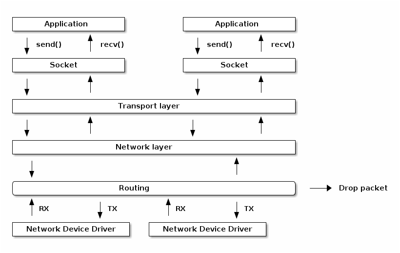
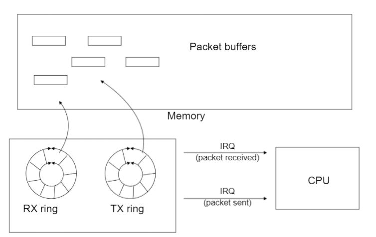

# Network

## About

Collection of classes for the network communication.


## Network management

Useful links tat were used to write this part:
- [Linux Labs network management](https://linux-kernel-labs.github.io/refs/heads/master/lectures/networking.html)
- [Beej's Guide to Network Programming](https://www.beej.us/guide/bgnet/html/)
- [Linux IP Networking](https://www.cs.unh.edu/cnrg/people/gherrin/linux-net.html)
- [Hacking the Linux Kernel Network Stack](http://phrack.org/issues/61/13.html)


Network stack consist of multiple laeyers and can be considered



For low latency critical system it creates a challange that a lot of operations happen in kernel space where we can't control copy and memory allocation.
As well interrapts are not designed for low latency, but interaps is one of the main mechanism in kernel to notify about occuring events.

Example of the CPU access of the recieved data.




## Link layer and Ethenet
In computer networking, the link layer is the lowest layer in the Internet protocol suite, the networking architecture of the Internet. The link layer is the group of methods and communications protocols confined to the link that a host is physically connected to. The link is the physical and logical network component used to interconnect hosts or nodes in the network and a link protocol is a suite of methods and standards that operate only between adjacent network nodes of a network segment [[Wiki](https://en.wikipedia.org/wiki/Link_layer)]. 

Ethernet is a family of wired computer networking technologies commonly used in local area networks (LAN), metropolitan area networks (MAN) and wide area networks (WAN)[[wiki](https://en.wikipedia.org/wiki/Ethernet)].

To better understand how to configure the network on Linux see [Understanding and Configuring Linux Network Interfaces](https://www.baeldung.com/linux/network-interface-configure)

### Ethernet frame

Standard is defined in [802.3-2022 - IEEE Standard for Ethernet]( https://ieeexplore.ieee.org/servlet/opac?punumber=9844414)

Ethernet frame is a data link layer protocol data unit and uses the underlying Ethernet physical layer transport mechanisms. In other words, a data unit on an Ethernet link transports an Ethernet frame as its payload[[wiki](https://en.wikipedia.org/wiki/Ethernet_frame)].


> **Note**: There is a big collection of internet communications. So the frame struct might be different based on the concrete format.

Here is the example how the full frame looks like:


All packages recived via socket in linux are managed by `struct sk_buff`, that is part of linux kernel.
We will not cover it, but if you are curious, see: [skbuff.h](https://github.com/torvalds/linux/blob/master/include/linux/skbuff.h)

Also for more detail ow to configure the network see [Linux IP Networking](https://www.cs.unh.edu/cnrg/people/gherrin/linux-net.html)

## IP


The structure of an IP header (struct iphdr) has the following fields:
```c
struct iphdr {
#if defined(__LITTLE_ENDIAN_BITFIELD)
      __u8    ihl:4,
              version:4;
#elif defined (__BIG_ENDIAN_BITFIELD)
      __u8    version:4,
              ihl:4;
#else
#error        "Please fix <asm/byteorder.h>"
#endif
      __u8    tos;
      __be16  tot_len;
      __be16  id;
      __be16  frag_off;
      __u8    ttl;
      __u8    protocol;
      __sum16 check;
      __be32  saddr;
      __be32  daddr;
      /*The options start here. */
};
```

where:
- protocol is the transport layer protocol used;
- saddr is the source IP address;
- daddr is the destination IP address.


## UDP

[See Docs](./inc/udp/README.md)


## TCP

[See Docs](./inc/tcp/README.md)

