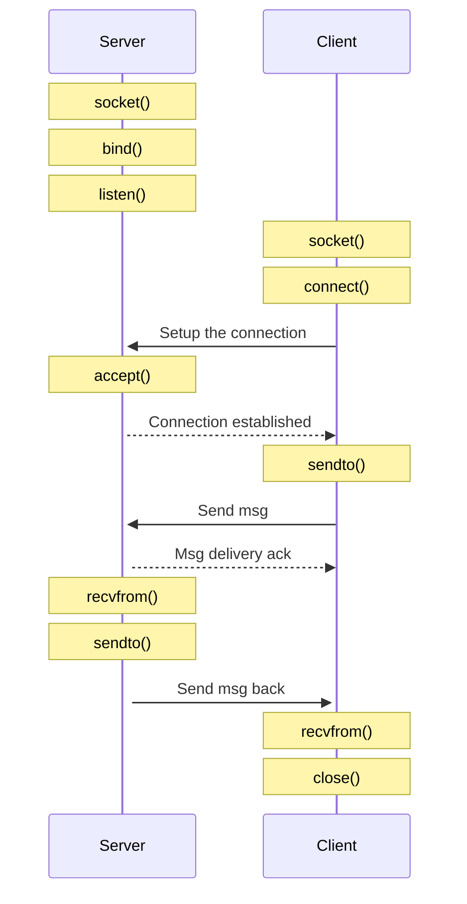

# IP/TCP

The Transmission Control Protocol (TCP) is intended for use as a highly
reliable host-to-host protocol between hosts in packet-switched computer
communication networks, and in interconnected systems of such networks.

Basic definition [rfc793](https://www.rfc-editor.org/rfc/rfc793).

Latest version of the protocol is defined in [rfc9293](https://www.ietf.org/rfc/rfc9293.html).

## Header example

```
0                   1                   2                   3
0 1 2 3 4 5 6 7 8 9 0 1 2 3 4 5 6 7 8 9 0 1 2 3 4 5 6 7 8 9 0 1
+-+-+-+-+-+-+-+-+-+-+-+-+-+-+-+-+-+-+-+-+-+-+-+-+-+-+-+-+-+-+-+-+
|          Source Port          |       Destination Port        |
+-+-+-+-+-+-+-+-+-+-+-+-+-+-+-+-+-+-+-+-+-+-+-+-+-+-+-+-+-+-+-+-+
|                        Sequence Number                        |
+-+-+-+-+-+-+-+-+-+-+-+-+-+-+-+-+-+-+-+-+-+-+-+-+-+-+-+-+-+-+-+-+
|                    Acknowledgment Number                      |
+-+-+-+-+-+-+-+-+-+-+-+-+-+-+-+-+-+-+-+-+-+-+-+-+-+-+-+-+-+-+-+-+
|  Data |       |C|E|U|A|P|R|S|F|                               |
| Offset| Rsrvd |W|C|R|C|S|S|Y|I|            Window             |
|       |       |R|E|G|K|H|T|N|N|                               |
+-+-+-+-+-+-+-+-+-+-+-+-+-+-+-+-+-+-+-+-+-+-+-+-+-+-+-+-+-+-+-+-+
|           Checksum            |         Urgent Pointer        |
+-+-+-+-+-+-+-+-+-+-+-+-+-+-+-+-+-+-+-+-+-+-+-+-+-+-+-+-+-+-+-+-+
|                           [Options]                           |
+-+-+-+-+-+-+-+-+-+-+-+-+-+-+-+-+-+-+-+-+-+-+-+-+-+-+-+-+-+-+-+-+
|                                                               :
:                             Data                              :
:                                                               |
+-+-+-+-+-+-+-+-+-+-+-+-+-+-+-+-+-+-+-+-+-+-+-+-+-+-+-+-+-+-+-+-+

      Note that one tick mark represents one bit position.
```

## TCP struct

```c
struct tcphdr {
      __be16  source;
      __be16  dest;
      __be32  seq;
      __be32  ack_seq;
#if defined(__LITTLE_ENDIAN_BITFIELD)
      __u16   res1:4,
              doff:4,
              fin:1,
              syn:1,
              rst:1,
              psh:1,
              ack:1,
              urg:1,
              ece:1,
              cwr:1;
#elif defined(__BIG_ENDIAN_BITFIELD)
      __u16   doff:4,
              res1:4,
              cwr:1,
              ece:1,
              urg:1,
              ack:1,
              psh:1,
              rst:1,
              syn:1,
              fin:1;
#else
#error        "Adjust your <asm/byteorder.h> defines"
#endif
      __be16  window;
      __sum16 check;
      __be16  urg_ptr;
};
```

where:
- source is the source port;
- dest is the destination port;
- syn, ack, fin are the TCP flags used;

## Diagram



## Links

See links from [UDP](../udp/README.md)

- [Linux Networking](https://linux-kernel-labs.github.io/refs/heads/master/labs/networking.html)
- [About TCP](https://www.man7.org/linux/man-pages/man7/tcp.7.html)
- [listen](https://www.man7.org/linux/man-pages/man2/listen.2.html)
- [accept](https://www.man7.org/linux/man-pages/man2/accept.2.html)
