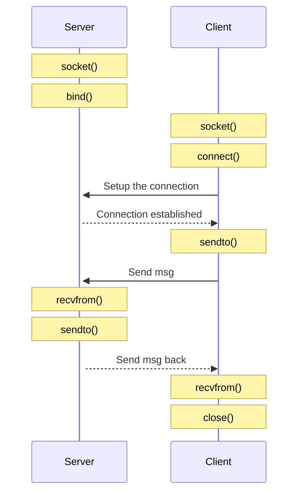

# IP/UDP

## Links

- [About UDP](https://www.man7.org/linux/man-pages/man7/udp.7.html)
- [socket()](https://www.man7.org/linux/man-pages/man2/socket.2.html)
- [bind()](https://www.man7.org/linux/man-pages/man2/bind.2.html)
- [connect()](https://www.man7.org/linux/man-pages/man2/connect.2.html)
- [sendto()](https://www.man7.org/linux/man-pages/man2/sendto.2.html)
- [recvfrom()](https://www.man7.org/linux/man-pages/man2/recvfrom.2.html)
- [close()](https://www.man7.org/linux/man-pages/man2/close.2.html)

## Diagram

