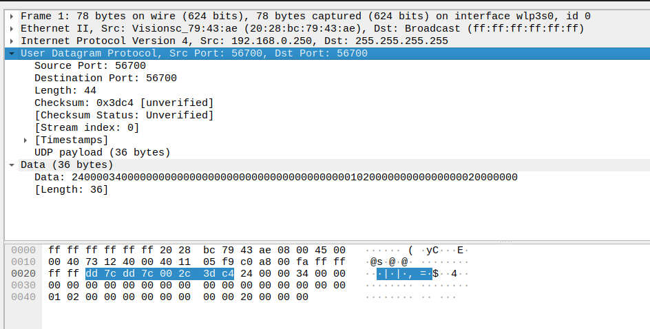
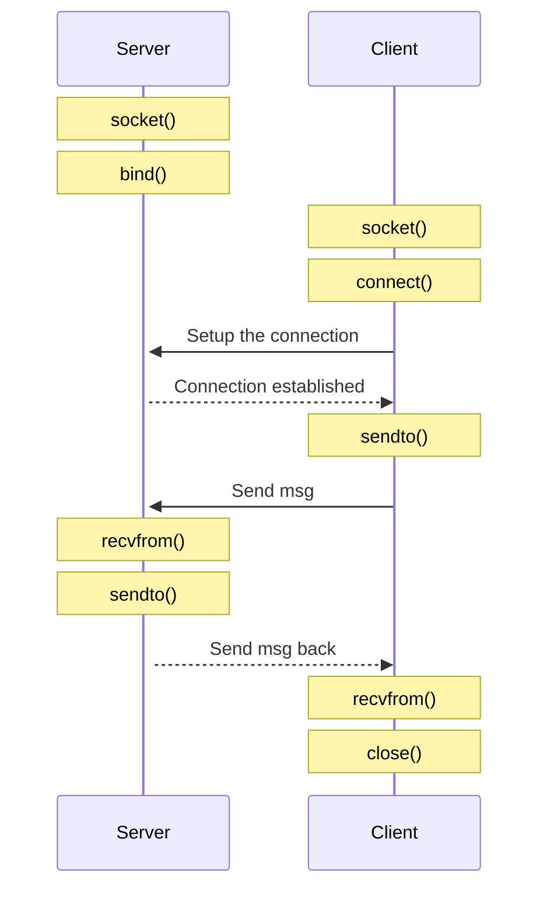

# IP/UDP


## UDP

This User Datagram  Protocol  (UDP)  is  defined  to  make  available  a
datagram   mode  of  packet-switched   computer   communication  in  the
environment  of  an  interconnected  set  of  computer  networks.   This
protocol  assumes  that the Internet  Protocol  (IP)  [1] is used as the
underlying protocol.

UDP overhead: 64 bites.


### User Datagram Header Format

```
0       7 8     15 16    23 24    31
+--------+--------+--------+--------+
|     Source      |   Destination   |
|      Port       |      Port       |
+--------+--------+--------+--------+
|                 |                 |
|     Length      |    Checksum     |
+--------+--------+--------+--------+
|
|          data octets ...
+---------------- ...

```


### Example: UDP message




### UDP properties

1. No guarantee in the delivery
2. No guarantee in delivery order

## Diagram




## Send and recieve data

We provide comparision for receive operation.
Send has the same logic and will be droped.

### read() vs recv()

Both `read()` and `recv()` can read data from a file descriptor into the provided buffer.

```cpp
ssize_t read(int     fd, void buf[.count], size_t count);
ssize_t recv(int sockfd, void buf[.len],   size_t len,    int flags);
```


If in the function `recv()` we set flags to 0 -> it will be almost the same as function `read()`. Only exception is handling the 0 size data from the socket.

For example:

```cpp
#include <iostream>

struct NullSizeStruct {
    char buffer[0];
};

int main() {
    std::cout << sizeof(NullSizeStruct) << std::endl;
    return 0;
}
```

If `read()` will ignore the `NullSizeStruct` and keep in the queue, while `recv()` will remove the `NullSizeStruct` from the queue.


### recv() vs recvfrom() vs recvmsg()

```cpp
recv(sockfd, buf, len, flags);
```

is equivalent to
```cpp
recvfrom(sockfd, buf, len, flags, NULL, NULL);
```


### recvmsg() vs recvmmsg()

[recvmmsg](https://www.man7.org/linux/man-pages/man2/recvmmsg.2.html) - receive multiple messages on a socket.

The recvmmsg() system call is an extension of recvmsg(2) that
allows the caller to receive multiple messages from a socket
using a single system call.  (This has performance benefits for
some applications.)  A further extension over recvmsg(2) is
support for a timeout on the receive operation.

## System calls for socket programming

Full list of available linux system calls for x86_64 can be found at [syscall.tbl](https://github.com/torvalds/linux/blob/master/arch/x86/entry/syscalls/syscall_64.tbl)

System calls:

- socket -> `int __sys_socket(int family, int type, int protocol)` [socket.c](https://github.com/torvalds/linux/blob/master/net/socket.c)

`socket()` uses dynamic memory allocation:

```c
/**
 *	sock_alloc - allocate a socket
 *
 *	Allocate a new inode and socket object. The two are bound together
 *	and initialised. The socket is then returned. If we are out of inodes
 *	NULL is returned. This functions uses GFP_KERNEL internally.
 */

struct socket *sock_alloc(void)
{
        struct inode *inode;
        struct socket *sock;

        inode = new_inode_pseudo(sock_mnt->mnt_sb);
        if (!inode)
                return NULL;

        sock = SOCKET_I(inode);

        inode->i_ino = get_next_ino();
        inode->i_mode = S_IFSOCK | S_IRWXUGO;
        inode->i_uid = current_fsuid();
        inode->i_gid = current_fsgid();
        inode->i_op = &sockfs_inode_ops;

        return sock;
}
```

- bind -> `int __sys_bind(int fd, struct sockaddr __user *umyaddr, int addrlen)`: [socket.c](https://github.com/torvalds/linux/blob/master/net/socket.c)

... (research can be done on demand. Use example from `socket()`)


## Use of connect() for UDP

To send the message from client to server we can drop `connect()` and use the flow:

```cpp
int sock = socket(...);
sendto(sock, buff, len, 0, dest_addr, sizeof(dest_addr));
```

In this case the destinaion will be lokkedup on eacj call of `sendto()` that will slow
down communication. If we expect to issue single request and close the connection, it is
ok. But if we expect to send multiple messages, we should first call `connect()` to memorize
the destination and later call `sendto()`.


## Links

- [About UDP](https://www.man7.org/linux/man-pages/man7/udp.7.html)
- [socket()](https://www.man7.org/linux/man-pages/man2/socket.2.html)
- [bind()](https://www.man7.org/linux/man-pages/man2/bind.2.html)
- [connect()](https://www.man7.org/linux/man-pages/man2/connect.2.html)
- [sendto()](https://www.man7.org/linux/man-pages/man2/sendto.2.html)
- [recvfrom()](https://www.man7.org/linux/man-pages/man2/recvfrom.2.html)
- [close()](https://www.man7.org/linux/man-pages/man2/close.2.html)

